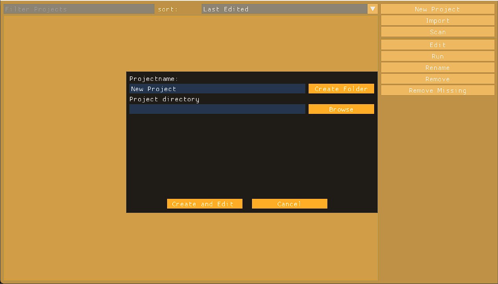

# creating a new project:
to create a new project press the button on the right
and you should see the following popup:

if you wan't to change the directory where the project is created press browse button.

{: .note}
> by default the directory from wich the engine is launched is used by default as project directory.

{: .note}
> all the project files will be put inside the projectDirectory.
> because of this it is highly recommended to select the folder where you want the project to be located.

then pick a project name and press create folder.
it is in this folder that all the project files will be created.
after this the project editor will open up and with a blank unsaved scene.

