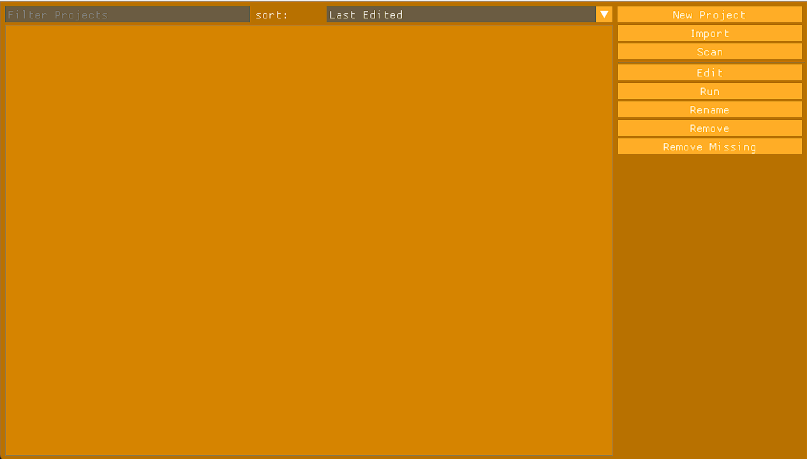
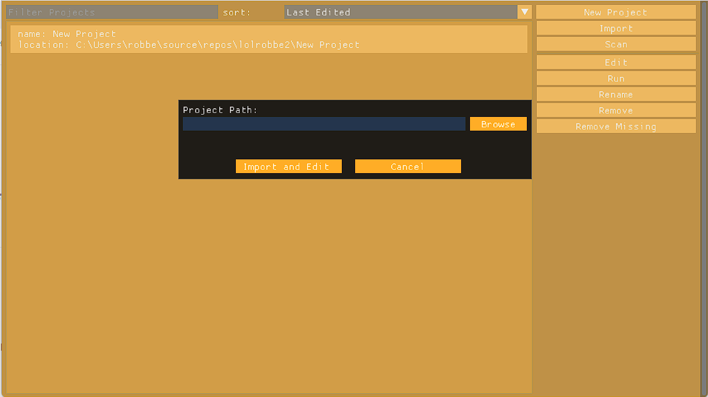

--- 
title: importing an existing project
layout: default
parent: projects
---
# importing an existing project

to import you should be on the project mangement screen:

Then press the import project button, after that you should see the following popup window:

then click browse and select the file with the name of your project and wich has the .lprj extension.

after that click the import and open button to edit your project.

{: .note}
> importing a project copies the project file to the appdata folder allowing it to be detected by the engine on startup.